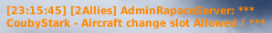

Vorstellung der ELO Dogfight Challenge von Coubystark.


## In Kürze

Der ELO Dogfight Server bietet dir die Durchführung **1 gegen 1 Schießerei**, mit dem Flugzeug deiner Wahl, **H24**, 7/7.</br>
Die Spiele werden **in 3 Punkten** gespielt (mögliche Ergebnisse: 3:0 oder 2:1).</br>
Alle Spielergebnisse werden auf dem Server gespeichert, und für jeden Piloten wird ein **"ELO"** berechnet, **pro eingesetztem Flugzeug**, basierend auf dem Ergebnis jedes Spiels.




## Kampfarenen


Der Server enthält Kampfarenen, die entsprechend dem Level (ELO) der Spieler reserviert sind:
- 6 Kampfgebiete für LVL1-Spieler, von BA1-1 bis BA1-6 - reserviert für Spieler, deren ELO (für das verwendete Flugzeug) zwischen 1000 und 1400 liegt
- 4 Kampfgebiete für LVL2-Spieler, von BA2-1 bis BA2-4 - reserviert für Spieler, deren ELO zwischen 1400 und 1800 liegt
- 3 Kampfgebiete für LVL3-Spieler, von BA3-1 bis BA3-3 - reserviert für Spieler, deren ELO zwischen 1800 und 2200 liegt
- 3 Kampfgebiete für LVL4-Spieler, von BA4-1 bis BA4-3 - reserviert für Spieler, deren ELO zwischen 2200 und 2600 liegt
- 1 Kampfgebiete für LVL5-Spieler, der BA5-1 - reserviert für Spieler, deren ELO größer als 2600 ist

Sie finden die Referenz von Battle Area und zugehörigem LVL am Anfang des Gruppennamens des Flugzeugs des Slots:


## AutoSpawn-Skript

Die Implementierung des AutoSpawn-Skripts ist zwingend erforderlich, um auf einer Serverebene stecken zu können.

💾 [AutoSpawn-Skript herunterladen](ELO-DF_auto-spawn_GameGUI.lua)



Einzurichten in **```[user]\Saved Games\DCS.Openbeta\Scripts\Hooks```**.

Dieses Skript ermöglicht es, am Ende einer Runde die beiden Spieler automatisch neu zu setzen!

Mit der Einrichtung dieses Skripts und dem Slot auf einem Flugzeug auf dem ELO Dogfight Server akzeptieren Sie die in diesem digitalen Raum geltenden Teilnahme- und Nutzungsregeln.


## So fügen Sie eine Serverebene ein

Die Voraussetzungen, um einem Slot beitreten zu können:
- Alle Slots des gleichen Lagers auf demselben Kampfgebiet müssen frei sein - wenn ein Spieler bereits anwesend ist, können Sie keinen Slot spielen.
- Sie müssen über ein LVL/ELO verfügen, das mit dem LVL des Slot für das Flugzeug übereinstimmt, dem Sie beitreten möchten. Sie können LVL2 auf M-2000C sein und somit nur auf den M-2000C-Steckplätzen von BA2-1 bis BA2-4 stecken, während Sie LVL1 auf F-15C sind, also nur auf den F-15C-Steckplätzen von BA1-1 bis BA1-6 stecken können.
- Sie müssen das AutoSpawn-Skript installiert haben

Wenn alle Bedingungen erfüllt sind, erhalten Sie eine Meldung wie folgt:


Wenn Sie nicht die richtige LVL für das Flugzeug/BattleArea-Paar haben, das Sie eingeben möchten, erhalten Sie eine Meldung wie diese:


Wenn Sie sich auf einem Slot eines BA-Camps befinden, können Sie zu einem anderen Slot wechseln (vorausgesetzt, dass Ihr LVL für dieses Flugzeug übereinstimmt), Sie erhalten eine Nachricht wie folgt:




## Start des Spiels

Dieser Moment kann ein wenig knifflig sein, besonders wenn du spawnst, während du darauf wartest, dass ein Spieler der Arena im gegenüberliegenden Lager beitritt...

Ideal ist es, den Eintritt in die Arena mit dem Gegner abzustimmen, um mit den Treibstoffwerten zu beginnen, die gut laufen. Dies hilft auch sicherzustellen, dass Sie sich auf das Flugzeug einigen, das alle verwenden.

Beachten Sie jedoch, dass Sie das Match nicht durchführen können, solange es keinen Kill gegeben hat. Sie können Zuschauer werden und bei Bedarf mit dem Gegner in einen Dialog treten. Auch hier ist es am besten, zugestimmt zu haben, bevor jemand mit dem Laichen beginnt...

Aber Vorsicht, von dem Moment an, in dem es einen Kill gegeben hat, gilt das Spiel als begonnen! Und Sie müssen nach den gespielten 3 Punkten gehen.

Wenn einer der Teilnehmer den Server vor dem Ende eines Spiels verlässt, werden alle noch zu spielenden Punkte an den auf dem Server verbleibenden Punkte vergeben.

## Sobald das Spiel begonnen hat

Ein Kill wird validiert, wenn der Mörder sein Opfer für mindestens 10 Sekunden überlebt.

Ein Countdown wird in Schritten von 2 Sekunden angezeigt.

Am Ende des Countdowns werden beide Spieler automatisch respawnt und die Zwischenpunktzahl wird im Chat angezeigt.

Wenn der Killer vor 10 Sekunden stirbt, oder im Fall von **Lucky Luke**, gilt die Runde als ungültig und der Punkt wird wiederholt.

## Ende des Spiels

Sobald der letzte Kill validiert ist, wird das Endergebnis sowie dein neues **ELO für das verwendete Flugzeug** angezeigt.

Du wirst automatisch als Zuschauer positioniert, um das Kampfgebiet zu befreien.

## Ein letztes Wort

Bei ELO Dogfight habe ich versucht, ein möglichst flüssiges und dynamisches Erlebnis zu bieten (AutoSpawn-Skript), sowie die Bedingungen, die ein Match unter den erwarteten Bedingungen anbietet, automatisch zu begrenzen (Einschränkungen des Slots in Bezug auf Besetzung, Level, aktuelle Matches ...). Es sind jedoch Sie, Ihr Geisteszustand, Ihre kleinen Worte für Ihre Konkurrenten, Ihre Ratschläge für Neulinge, die es diesem Server ermöglichen können, ein lustiger und cooler Ort zu sein, an dem jeder herausfordern, Fortschritte machen und seine Fähigkeit zeigen kann, Kanon zu engagieren. Ich zähle darauf, dass Sie diesen Geist pflegen, und ich wünsche Ihnen **viel Spaß beim Jagen!**

[Einige ergänzende Regeln](/regles/).

Wenn du irgendwelche Fragen hast, kannst du sie gerne auf Discord stellen. Ich werde später eine Seite mit den häufigsten Fragen und Antworten hinzufügen.
