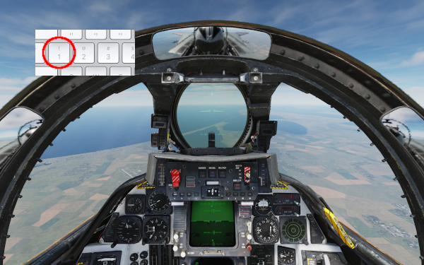



## Una vez en el juego

### ¿Cómo sé si se produjo la primera fusión?
Este punto puede ser complicado, especialmente para los recién llegados. Recomendamos asegurar un cruce lo más cerca posible.

De lo contrario, cuando ves que los dos aviones han comenzado a girar después de haber hecho más de 90 ° de cambio de rumbo ... ¡Significa que la fusión ha pasado!

¡Sé caballeroso y comienza con un cruce de casco!

### ¿Qué hacer si el script AutoSpwan "falla"?
Todavía puedes hacer una reaparición manual. Conviértete en un espectador y vuelve a colocarte en tu avión (coordina con el oponente). Verás que desde el momento en que tengas una partida en curso, el servidor no te permitirá unirte a otra ranura.

### ¿Cómo puedo saber mis ELOs y LVL cuando estoy en DCS?
Simplemente haga la pregunta en el chat DCS (= **ELOs?** comando chat):

### ¿Qué pasa si ambos aviones se quedan sin combustible y logran aterrizar?
¡Sé **juego limpio**! Por intercambio de audio / chat te refieres a expulsar al mismo tiempo. Esto hará una ronda "nula" que tendrá que ser rejugada.

### Para los competidores de F-14, ¿cómo evitas que Jester se eyecte?
La única forma identificada de hacerlo es desactivar el asiento eyectable de Jester.
Para ello, en cada ronda, hay que hacer un pase en el asiento trasero. Presione la tecla 2 en el teclado:

Desactive el asiento eyectable:

Regrese al asiento delantero, tecla 1 en el teclado:

Si alguien conoce una forma más fácil / efectiva de evitar que Jester se expulse, por favor compártala con CoubyStark.

## Opciones de diseño de ELO Dogfight

### ¿Cómo encontrar el servidor ELO Dogfight?
Busca **Raptor** o **ELO Dogfight**.

### ¿Qué es la configuración del servidor?

### ¿Cómo se establecen los niveles iniciales de combustible?
Por el momento, utilizando la misma configuración que en el **canon BFR competition** y/o el servidor **Dogfighters**.

Deben permitir 5 minutos de postcombustión completa / acelerador completo a cada aeronave.

Este punto será estudiado y documentado más finamente para tener en cuenta los diferentes consumos según las altitudes. Esto es para garantizar un equilibrio aún más justo.

### ¿Qué es ELO?
El ELO representa la fuerza de un competidor y permite clasificar/comparar jugadores.
Este principio proviene del juego de ajedrez. Consulte el artículo de Wikipedia [Sistema de puntuación Elo](https://es.wikipedia.org/wiki/Sistema_de_puntuaci%C3%B3n_Elo).

### ¿Se tiene en cuenta el número de peleas jugadas en el coeficiente ELO? ¿Podemos tener un buen ELO jugando pocos partidos? ¿Podemos aumentar nuestro ELO indefinidamente jugando siempre contra las mismas personas?
El número de peleas jugadas está implícitamente integrado en el principio del cálculo ELO. De hecho, el ELO representa la "fuerza" de un jugador para determinadas condiciones de juego. Cuanto más ha jugado un jugador **un gran número de partidos** y contra **un número variado de jugadores**, **más representativo es su coeficiente ELO de su fuerza**. 
El buen funcionamiento de la base de este algoritmo de cálculo es un problema matemático que han estudiado matemáticos experimentados. Al ser utilizado durante mucho tiempo para competiciones de ajedrez, tenemos confianza en este. 
El **factor K** retenido en la configuración del algoritmo en ELO Dogfight, no permite a un jugador lograr un súper ELO en unas pocas partidas. Realmente tienes que jugar muchos juegos para poder aumentar tu ELO significativamente. 
Además, el principio de "niveles" establecido limita muy fuertemente la posibilidad de aumentar indefinidamente su ELO jugando siempre contra las mismas personas.

### ¿Quién organiza y administra ELO Dogfight?
**CoubyStark**, bajo la bandera de **Cellule Rapaces**, equipo de eSport de la **comunidad de jugadores de la Fuerza Aérea y Espacial Francesa**.

## En manos de jugadores

### ¿Puedo luchar contra cualquier avión con cualquier avión?
Sí.

Sin embargo, presta atención al equilibrio del partido. Depende de cada jugador elegir / administrar qué aviones usan y contra qué luchan. También requiere estar de acuerdo con el adversario del momento. No hay imposición/obligación. Pero tenga en cuenta que el cálculo de ELO para el avión que está utilizando solo tiene en cuenta el resultado del partido y el ELO del oponente en el avión que está utilizando. El cálculo del ELO no tiene en cuenta el tipo de aeronave enfrentada.

### ¿Es posible la suplantación o el conflicto de identidad?
No.
Todos los resultados a nivel de servidor incluyen UCID de jugadores. Este es un identificador único asociado con la cuenta DCS del jugador.
Los resultados mostrados a nivel de sitio web no exponen este UCID. Estos se basan en el apodo. Sin embargo, tan pronto como haya un conflicto de apodo, se advierte al administrador que se ocupe manualmente de la situación. Ajustará el apodo del último jugador con este (agregando una pista).

### ¿Es posible modificar mi apodo de jugador que aparece en los resultados?
Sí.
Para hacer esto, póngase en contacto con **CoubyStark** en Rapace Discord.
