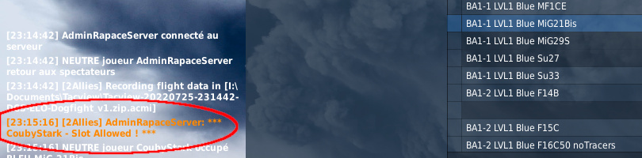

Présentation du défi ELO Dogfight, par Coubystark.


## En bref

Le serveur ELO Dogfight vous propose de réaliser des **combats canon 1 contre 1**, avec l'avion de votre choix, **H24**, 7/7.</br>
Les matchs se jouent **en 3 points** (résultats possibles : 3-0 ou 2-1).</br>
Tous les résultats de matchs sont enregistrés sur le serveur, et un **"ELO"** est calculé pour chaque pilote, **par avion utilisé**, en fonction du résultat de chaque match.




## Arènes de combat


Le serveur comprend des arènes de combat réservées en fonction du niveau (ELO) des joueurs :
- 6 Battle Areas pour les joueurs LVL1, de BA1-1 à BA1-6 - réservées aux joueurs dont le ELO (pour l'avion utilisé) est compris entre 1000 et 1400
- 4 Battle Areas pour les joueurs LVL2, de BA2-1 à BA2-4 - réservées aux joueurs dont le ELO est compris entre 1400 et 1800
- 4 Battle Areas pour les joueurs LVL3, de BA3-1 à BA3-4 - réservées aux joueurs dont le ELO est compris entre 1800 et 2200
- 3 Battle Areas pour les joueurs LVL4, de BA4-1 à BA4-3 - réservées aux joueurs dont le ELO est compris entre 2200 et 2600
- 1 Battle Areas pour les joueurs LVL5, la BA5-1 - réservée aux joueurs dont le ELO est supérieur à 2600

Vous pouvez retrouver la référence de Battle Area et LVL associé dans le début du nom de groupe de l'avion du slot :


## Script AutoSpawn

La mise en place du script AutoSpawn est obligatoire afin de pouvoir sloter sur un avion du serveur.

💾 [Télécharger le script AutoSpawn](ELO-DF_auto-spawn_GameGUI.lua)



A mettre en place dans **```[utilisateur]\Saved Games\DCS.Openbeta\Scripts\Hooks```**.

Ce script permet, à l'issue d'une manche, de faire resloter automatiquement les deux joueurs !

En mettant en place ce script et en slotant sur un avion du serveur ELO Dogfight, vous acceptez les règles de participation et d'usage en vigueur dans cet espace numérique.


## Pour sloter dans un avion du serveur

Les conditions requises pour pouvoir rejoindre un slot :
- tous les slots du même camp sur une même Battle Area doivent être libres - si un joueur est déjà présent, vous ne pourrez pas sloter.
- vous devez avoir un LVL/ELO en adéquation avec le LVL du slot pour l'avion que vous chercher à rejoindre; vous pouvez être LVL2 sur M-2000C, et ne pourrez ainsi sloter que sur les slots M-2000C des BA2-1 à BA2-4, tout en étant LVL1 sur F-15C ne pouvant ainsi sloter que sur les slots F-15C des BA1-1 à BA1-6.
- vous devez avoir le script AutoSpawn installé

Si toutes les conditions sont réunies, vous aurez un message comme suit :


Si vous n'avez pas le LVL qui va bien pour le couple avion/BattleArea sur lequel vous essayez d'entrer, vous aurez un message comme celui-ci :


Lorsque vous êtes sur un slot d'un camp d'une BA, vous pouvez changer pour un autre slot (sous réserve que votre LVL pour cet avion corresponde), vous aurez alors un message comme suit :


## Début du match

Ce moment peut être un peu délicat, surtout si vous spawnez en attendant qu'un joueur rejoigne l'arène dans le camp en face...

L'idéal est de coordonner l'entrée dans l'arène avec son adversaire, afin de débuter avec les niveaux de carburants qui vont bien. Cela permet également de s'assurer que vous êtes d'accord sur l'avion utilisé par chacun.

Sachez toutefois que vous pouvez ne pas engager le match, tant qu'il n'y a pas eu un kill. Vous pouvez passer en spectateur et engager le dialogue avec l'adversaire si nécessaire. Encore une fois, il est préférable de s'être entendu avant que quiconque ne commence à spawner...

Mais attention, à partir du moment où il y a eu un kill, le match est considéré comme engagé ! Et vous devez aller au bout des 3 points joués.

Si l'un des compétiteurs quitte le serveur avant la fin d'un match, tous les points restant à jouer sont attribués à celui resté sur le serveur.


## Une fois le match engagé

Un kill est validé si le killer survit au moins 10 secondes à sa victime.

Un décompte est affiché par pas de 2 secondes.

A la fin du décompte, les deux joueurs sont respawnés automatiquement, et le score intermédiaire est affiché dans le chat.

Si le killer décède avant les 10 secondes, ou en cas de **Lucky Luke**, la manche est considérée comme nulle et le point est rejoué.


## Fin du match

Une fois le dernier kill validé, le score final est affiché ainsi que votre nouveau **ELO pour l'avion utilisé**.

Vous êtes automatiquement positionné en spectateur, afin de libérer la Battle Area.


## Un dernier mot

Sur ELO Dogfight, j'ai cherché à proposer une expérience la plus fluide et dynamique possible (script AutoSpawn), ainsi qu'à borner de manière automatique les conditions offrant un match dans les conditions attendues (limitations pour sloter relativement à l'occupation, aux niveaux, matchs en cours...). Toutefois, c'est vous, votre état d'esprit, vos petits mots pour vos concurrents, vos conseils pour les nouveaux venus qui pouvez permettre à ce serveur d'être un endroit fun et cool où chacun peut venir défier, progresser et montrer son habileté à engager canon. Je compte sur vous pour nourrir cet esprit, et je vous souhaite **bonne chasse !**

[Quelques règles complémentaires](/regles/).

Si vous avez des questions, n'hésitez pas à venir les poser sur Discord. Je verrai pour ajouter plus tard une page reprenant les questions/réponses courantes.
