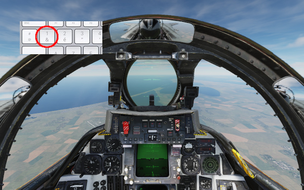
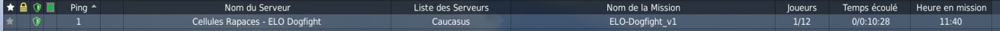
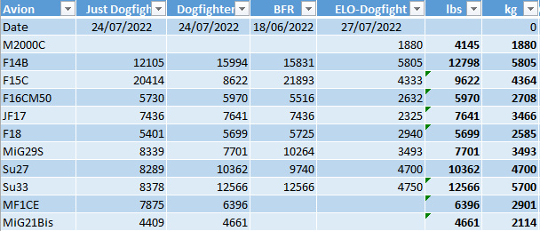



## Une fois en jeu

### Comment savoir si le premier merge a eu lieu ?
Ce point peut être délicat, en particulier pour les nouveaux venus. Nous recommandons d'assurer un croisement au plus près.

A défaut, lorsque vous voyez que les deux avions on commencé à se tourner autour en ayant fait plus de 90° de changement de cap... c'est que le merge est passé !

Soyez cheuvaleresque et commencez par un croisement au casque !

### Que faire si le script AutoSpwan "bugue" ?
Vous pouvez toujours faire un respawn manuel. Passez spectateur, et reslotez sur votre avion (coordonnez avec l'adversaire). Vous verrez qu'à partir du moment où vous avez un match en cours, le serveur ne vous permettra pas de rejoindre un autre slot.

### Comment connaître mes ELOs et LVL quand je suis dans DCS ?
Il suffit simplement de poser la question dans le chat (= commande chat **ELOs?**) :

### Que faire si les deux avions arrivent à court de carburant et parviennent à se poser ?
Soyez **fairplay** ! Par échange audio/chat entendez-vous pour vous éjecter en même temps. Cela fera une manche "nulle" qui sera à rejouer.

### Pour les compétiteurs sur F-14, comment empêcher Jester de s'éjecter ?
Le seul moyen idenitifé pour cela est de désactiver le siège éjectable de Jester.
Pour cela à chaque manche il vous faut faire un passage en place arrière. Appuyez sur la touche 2 du clavier :

Désactivez le siège éjectable :

Revenez en place avant, touche 1 du clavier :

Si quelqu'un voit une manière plus simple/efficace d'empêcher Jester de s'éjecter, ne pas hésiter à la partager avec CoubyStark.

## Choix de conception ELO DogFight

### Comment trouver le serveur ELO Dogfight ?
Cherchez **Rapace** ou **ELO Dogfight**.

### Quels sont les réglages du serveur ?

### Comment sont définis les niveaux de carburant initiaux ?
Pour le moment en s'appuyant sur les mêmes réglages que sur la **compétition canon BFR** et/ou le serveur **Dogfighters**.

Ils doivent permettre 5 minutes de pleine post-combustion/plein gaz à chaque avion.

Ce point sera étudié et documenté plus finement pour tenir compte des consommations différentes selon les altitudes. Ceci pour assurer un équilibre toujours plus juste.

### Qu'est ce que le ELO ?
Le ELO représente la force d'un compétiteur et permet de classer/comparer des joueurs.
Ce principe vient du jeu d'échecs. Consultez l'article wikipédia [classement ELO](https://fr.wikipedia.org/wiki/Classement_Elo).

### Le nombre de combats joués est-il pris en compte dans le coefficient ELO ? Peut-on avoir un bon ELO en jouant peu de matchs ? Peut-on indéfiniement monter son ELO en jouant toujours contre les mêmes personnes ?
Le nombre de combats joués est implicitement intégré au principe du calcul ELO. En effet le ELO représente la "force" d'un joueur pour des conditions de jeu données. Plus un joueur a joué **un grand nombre de matchs** et contre **un nombre varié de joueurs**, **plus son coefficient ELO est représentatif de sa force**. 
Le bon fonctionnement de la base de cet algorithme de calcul, constitue un problème mathématique sur lequel se sont penchés des mathématiciens chevronnés. Etant utilisé depuis longtemps pour les compétitions de jeu d'échec, nous avons confiance dans celui-ci. 
Le **facteur K** retenu dans le paramétrage de l'algorithme sur ELO Dogfight, ne permet pas à un joueur de réaliser un super ELO en peu de matchs. Il faut vraiment jouer beaucoup de rencontres pour pouvoir faire monter son ELO de manière significative. 
Par ailleurs, le principe de "niveaux" mis en place limite très fortement la possibilité de faire indéfiniement monter son ELO en jouant toujours contre les mêmes personnes.

### Qui organise et administre ELO Dogfight ?
**CoubyStark**, sous la bannière des **Cellules Rapaces**, équipe eSport de la **communauté des gamers de l'Armée de l'Air et de l'Espace**.

## A la main de chaque joueur

### Je peux affronter n'importe quel avion avec n'importe quel avion ?
Oui.

Attention toutefois à l'équilibre du match. Il appartient à chaque joueur de choisir/gérer quel avion il utilise et affronte. Cela nécessite aussi de s'accorder avec l'adversaire du moment. Il n'y a aucune imposition/obligation. Mais ne perdez pas de vu que le calcul du ELO pour l'avion que vous utilisez ne tient compte que du résultat du match et du ELO de l'adversaire sur l'avion qu'il utilise. Le calcul du ELO ne tient pas compte du type d'avion affronté.

### L'usurpation ou conflit d'identité est-elle possible ?
Non.
Les résultats au niveau du serveur intègrent tous l'UCID des joueurs. Il s'agit d'un identifiant unique associé au compte DCS du joueur.
Les résultats affichés au niveau du site web n'exposent pas cet UCID. Ceux-ci sont basés sur le nickname. Toutefois dès qu'il y a un conflit de nickname l'administrateur est avertis pour traiter manuellement la situation. Il ajustera le nickname du dernier joueur avec celui-ci (ajout d'un indice).

### Est-il possible de modifier mon nickname joueur affiché dans les résultats ?
Oui.
Pour cela il faut contacter **CoubyStark** sur le Discord Rapace.
