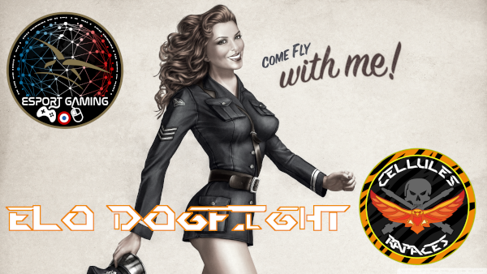
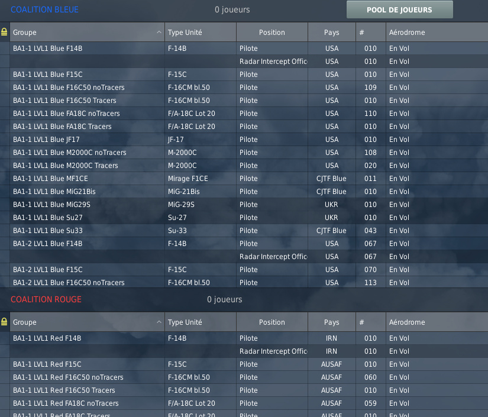

Presentazione della ELO Dogfight Challenge, di Coubystark.


## In breve

Il server ELO Dogfight ti offre di eseguire **1 contro 1 sparatoria**, con l'aereo di tua scelta, **H24**, 7/7.</br>
Le partite si giocano **in 3 punti** (risultati possibili: 3-0 o 2-1).</br>
Tutti i risultati delle partite vengono salvati sul server e viene calcolato un **"ELO"** per ogni pilota, **per aereo utilizzato**, in base al risultato di ogni partita.




## Arene di battaglia


Il server include arene di combattimento riservate in base al livello (ELO) dei giocatori:
- 6 aree di battaglia per i giocatori LVL1, da BA1-1 a BA1-6 - riservate ai giocatori il cui ELO (per l'aereo utilizzato) è compreso tra 1000 e 1400
- 4 aree di battaglia per i giocatori di LVL2, da BA2-1 a BA2-4 - riservate ai giocatori il cui ELO è compreso tra 1400 e 1800
- 3 aree di battaglia per i giocatori di LVL3, da BA3-1 a BA3-3 - riservate ai giocatori il cui ELO è compreso tra 1800 e 2200
- 3 aree di battaglia per i giocatori LVL4, da BA4-1 a BA4-3 - riservate ai giocatori il cui ELO è compreso tra 2200 e 2600
- 1 Aree di battaglia per i giocatori LVL5, il BA5-1 - riservato ai giocatori il cui ELO è superiore a 2600

Puoi trovare il riferimento di Battle Area e LVL associato all'inizio del nome del gruppo del piano dello slot:



## Script AutoSpawn

L'implementazione dello script AutoSpawn è obbligatoria per poter effettuare lo slot su un piano server.

💾 [Scarica AutoSpawn Script](ELO-DF_auto-spawn_GameGUI.lua)



Da allestire in **```[user]\Saved Games\DCS.Openbeta\Scripts\Hooks```**.

Questo script permette, alla fine di un round, di reinserire automaticamente i due giocatori!

Impostando questo script e inserendo un aereo sul server ELO Dogfight, accetti le regole di partecipazione e utilizzo in vigore in questo spazio digitale.

## Per inserire un piano server

I requisiti per poter partecipare a uno slot:
- tutte le slot dello stesso campo sulla stessa area di battaglia devono essere gratuite - se un giocatore è già presente, non sarai in grado di slot.
- devi avere un LVL/ELO in linea con l'LVL dello slot per l'aereo che stai cercando di raggiungere; puoi essere LVL2 su M-2000C, e quindi essere in grado di inserire solo gli slot M-2000C da BA2-1 a BA2-4, mentre essere LVL1 su F-15C potendo quindi essere in grado di slot solo sugli slot F-15C di BA1-1 a BA1-6.
- è necessario che sia installato lo script AutoSpawn

Se tutte le condizioni sono soddisfatte, verrà visualizzato un messaggio come segue:


Se non hai l'LVL corretto per la coppia aereo/BattleArea che stai tentando di inserire, riceverai un messaggio simile al seguente:


Quando ti trovi su uno slot di un campo BA, puoi passare a un altro slot (a condizione che il tuo LVL per questo aereo corrisponda), avrai quindi un messaggio come segue:


## Inizio del gioco

Questo momento può essere un po 'complicato, specialmente se ti spawni mentre aspetti che un giocatore si unisca all'arena nel campo opposto...

L'ideale è coordinare l'ingresso nell'arena con il tuo avversario, in modo da iniziare con i livelli di carburante che stanno andando bene. Questo aiuta anche a garantire che tu sia d'accordo sull'aeromobile che tutti stanno utilizzando.

Tieni presente, tuttavia, che non puoi ingaggiare la partita, purché non ci sia stata un'uccisione. Puoi diventare uno spettatore e impegnarti in un dialogo con l'avversario, se necessario. Ancora una volta, è meglio aver concordato prima che qualcuno inizi a deporre le uova ...

Ma attenzione, dal momento in cui c'è stata un'uccisione, la partita è considerata iniziata! E devi andare dopo i 3 punti giocati.

Se uno dei concorrenti lascia il server prima della fine di una partita, tutti i punti rimanenti da giocare vengono assegnati a quello lasciato sul server.

## Una volta iniziata la partita

Un'uccisione è convalidata se l'assassino sopravvive alla sua vittima per almeno 10 secondi.

Un conto alla rovescia viene visualizzato in passi di 2 secondi.

Alla fine del conto alla rovescia, entrambi i giocatori vengono rigenerati automaticamente e il punteggio intermedio viene visualizzato nella chat.

Se l'assassino muore prima di 10 secondi, o nel caso di **Lucky Luke**, il round è considerato nullo e il punto viene rigiocato.


## Fine della partita

Una volta convalidata l'ultima uccisione, viene visualizzato il punteggio finale e il nuovo **ELO per l'aereo utilizzato**.

Sei automaticamente posizionato come spettatore, al fine di liberare l'Area di Battaglia.

## Un'ultima parola

Su ELO Dogfight, ho cercato di offrire l'esperienza più fluida e dinamica possibile (script AutoSpawn), nonché di limitare automaticamente le condizioni offrendo una partita nelle condizioni previste (limitazioni allo slot relative all'occupazione, livelli, partite attuali ...). Tuttavia, sei tu, il tuo stato d'animo, le tue piccole parole per i tuoi concorrenti, i tuoi consigli per i nuovi arrivati che possono consentire a questo server di essere un luogo divertente e interessante in cui tutti possono venire a sfidare, progredire e mostrare la loro capacità di coinvolgere il canone. Conto su di te per nutrire questo spirito, e ti auguro **buona caccia!**

[Alcune norme complementari](/regles/).

Se hai domande, sentiti libero di venire a chiedere loro su Discord. Vedrò di aggiungere una pagina con le domande e le risposte comuni in seguito.
